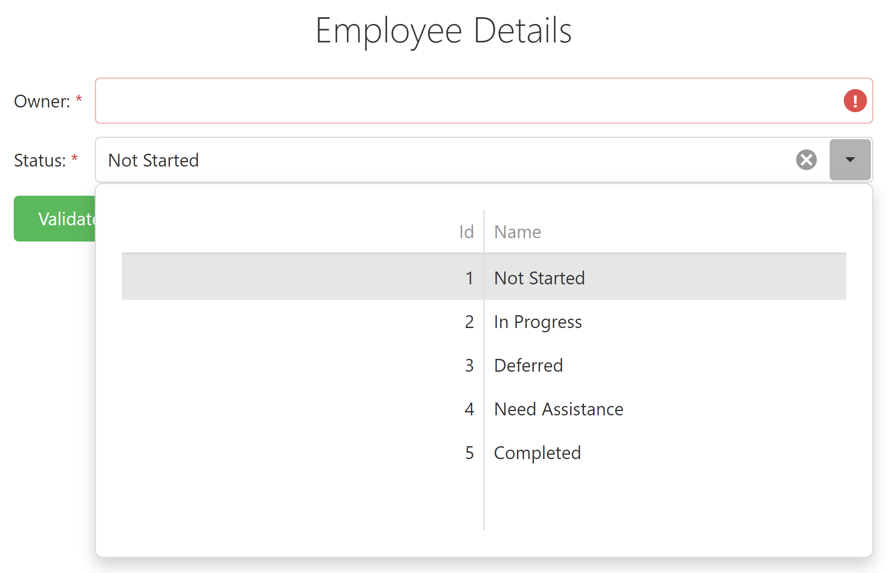

<!-- default badges list -->

<!-- default badges end -->
# Form for DevExtreme - Declare DropDownBox in a Form item

This example illustrates how to declare a DropDownBox in an item using [templates](https://js.devexpress.com/Documentation/ApiReference/UI_Widgets/dxForm/Item_Types/SimpleItem/#template):

Here, a Form item includes a DropDownBox editor with an embedded DataGrid. To implement validation for the editor and the Form, add the following logic:
- Assign the same validationGroup to the Form and the DropDownBox's Validator. See [dxForm.validationGroup](https://js.devexpress.com/Documentation/ApiReference/UI_Widgets/dxForm/Configuration/#validationGroup) and [dxValidator.validationGroup](https://js.devexpress.com/Documentation/ApiReference/UI_Widgets/dxValidator/Configuration/#validationGroup)
- Then, call the [DevExpress.validationEngine.validateGroup(group)](https://js.devexpress.com/Documentation/ApiReference/Common/Utils/validationEngine/#validateGroupgroup) method to validate the Form and the DropDownBox.

## Files to Review

- **Angular**
    - [app.component.html](Angular/src/app/app.component.html)
    - [app.component.ts](Angular/src/app/app.component.ts)
- **jQuery**
    - [index.html](jQuery/index.html)
- **React**
    - [App.js](React/src/App.jsx)
- **Vue**
    - [App.vue](Vue/src/App.vue)
- **ASP.NET**    
    - [Index.cshtml](ASP.NET/SampleApp/Views/Home/Index.cshtml)

## Documentation

- [Getting Started with Form](https://js.devexpress.com/Documentation/Guide/UI_Components/Form/Getting_Started_with_Form/)

- [Form - API Reference](https://js.devexpress.com/Documentation/ApiReference/UI_Components/dxForm/)
 
- [Data Validation](https://js.devexpress.com/Documentation/Guide/Widgets/Common/UI_Widgets/Data_Validation/)
